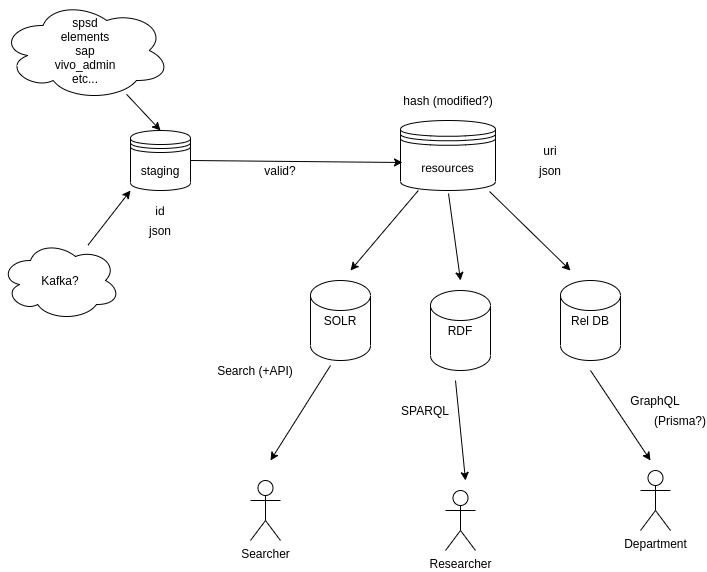

# Vivo Scramjet

# module github.com/vivo-community/vivo scramjet ?

A persistent cache of arbitrary json objects associated with 
an id, that can be validated against a service and, when valid,
examined for changes.

This makes it possible to gather some entities for ingest into
a store of some sort - and be able to send only adds, updates or
deletes to that store.

# as library (API)

* Staging Table

```go

import (
	sj "gitlab.oit.duke.edu/scholars/staging_importer"
)
...

	typeName := "person"
    // 1) add data
	person1 := TestPerson{Id: "per0000001", Name: "Test1"}
	person2 := TestPerson{Id: "per0000002", Name: "Test2"}
	// must use anything of interface 'Storeable'
	pass1 := sj.Passenger{Id: sj.Identifier{Id: person1.Id, Type: typeName}, Obj: person1}
	pass2 := sj.Passenger{Id: sj.Identifier{Id: person2.Id, Type: typeName}, Obj: person2}

	people := []sj.Storeable{pass1, pass2}
	err := sj.BulkAddStaging(people...)

    // 2) run through a 'validator' function - would likely
    //    be a json schema validator
	alwaysOkay := func(json string) bool { return true }
	list, rejects := sj.FilterTypeStaging("person", alwaysOkay)

    sj.BatchMarkValidInStaging(list)
    sj.BatchMarkInValidInStaging(rejects)

    // 3) Now the valid ones are marked and ready to go into
    //    'resource' table
    ...


    
```

* Resources Table

```go

import (
	sj "gitlab.oit.duke.edu/scholars/staging_importer"
)

...

	typeName := "person"
	list := sj.RetrieveValidStaging(typeName)
	err = sj.BulkMoveStagingTypeToResources(typeName, list...)

    ...

```

# as executable (CLI)


# General Idea

two tables, `staging` and `resources`

* staging: [id+type=uid]

  actions:
  * stash ->
  * validate -> 
  * stash and validate ->

* resources: [uri(type)=uid]

  actions:
  * move over valid (could be updates)
  * get actual updates (only)


# Basic structure



# Tables
